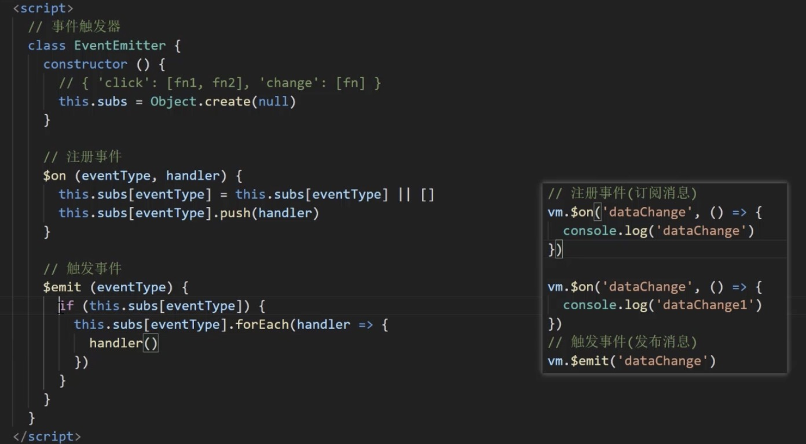

- vue3.x Proxy直接监听对象而非属性，因此在把多个属性转换getter setter的时候不需要循环

- 发布订阅模式：存在一个“信号中心”，某个任务执行完成，就向信号中心“发布”（publish）一个信号，其他任务可以向信号中心“订阅”（subscribe）这个信号，从而知道什么时候自己可以开始执行。

- 观察者模式：vue的响应式中使用的观察者模式，区别是没有事件中心，只有发布者（发布者）和订阅者（观察者），并且发布者需要订阅者的存在。

Q&A？get里面为什么不能return obj[key]，而是传入一个val return，因为每次obj[key]会触发get这样就会无限死循环，同时val是个局部变量，当我们访问vm.msg的时候这个值可以打印出来（局部变量在外面打印出来），因为defineReactive的参数obj其实是个this.$data对象，这样外部对这个get方法有引用，get里面用到了val return所以此处发生了闭包
